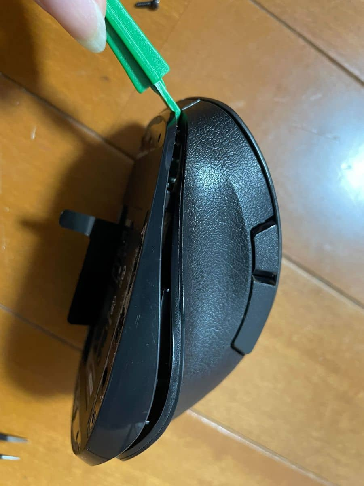

こんにちは、リーフです。

最近マウスホイールの動作が悪く、経年劣化だと諦めていました。

新調することを検討しつつ、マウスの誤作動について調べるとどうやらホイールの隙間にホコリがたまると誤作動を起こす場合があるようです。

そこで今回はダメもとでマウスを分解し、中のお掃除をしてみようかと思います。

今回使用するマウスはお気に入りの*エレコム EX-G シリーズの [M-XGL10DB](https://www.elecom.co.jp/products/M-XGL10DBBK.html)* です。

※マウスの保証期間内であれば、正式な手順で修理に出すことをおすすめします。

※一度分解してしまうとメーカー保証が受けられなくなる可能性もありますのでご注意ください。

### 使用する道具
今回、たまたま手元にあった特殊な道具を使用しました。

いくつか用意していますが、最低限ねじの形に合ったドライバーがあれば分解は可能です。

1. Y 型のドライバー

1. ピンセット (あまり使いませんでした)

1. ケースオープナー

### 蓋を開ける
0. ねじ山がなかった

さっそくねじを外して蓋を開けてみたいと思い、裏返しましたが*ねじ山*が見当たりませんでした。

マウスを使用している時は意識していなかったのですが、どうやらマウスソール(滑り止めのゴム)で隠されているようです。

1. マウスソールを剥がす

ねじ山を探す為にマウスソールを剥がしてみます。

※マウスソールは最後に戻しますので、なるべく丁寧に剥がします。

するとねじ山が出てきました。

4枚すべて剥がしてみましたがねじがあるのは3ヵ所でした。

2. ドライバーを使用してねじを外す

Y 型のドライバーを使ってねじを外していきます。

ねじはかなり小さいのでなくさないように注意してください。

ねじを外し終えました。

3. ケースオープナーを使用してマウスを開ける

蓋と本体の間にケースオープナーを少しずつ差し込み、開けていきます。

ある程度隙間ができると手で開けることができます。

蓋と本体がケーブルでつながっているので引っ張りすぎないように注意してください。

中を確認しましたが大きなホコリや目立った汚れはありませんでした。

念のためエアダスターをマウス全体に使用した後、ホイールの周りを ウェットティッシュタイプの OA クリーナーで優しく拭き取ります。

また今回は使用しませんでしたが、クリックボタンの電気的な接触が悪くなった場合で、感知する機構が機械式のものには[接点復活剤](https://www3.roymall.jp/shop/e/espray/#:~:text=%E6%8E%A5%E7%82%B9%E5%BE%A9%E6%B4%BB%E3%82%B9%E3%83%97%E3%83%AC%E3%83%BC%E3%81%A8%E3%81%AF,%E9%80%9A%E9%9B%BB%E3%81%97%E3%82%84%E3%81%99%E3%81%8F%E3%81%97%E3%81%BE%E3%81%99%E3%80%82)を使用すると改善することがあるようです。

使用上の注意などもありますので気になる方は調べてみてくださいね。

といったところで、掃除が完了したのでマウスを元に戻します。

マウスソールを貼り付けて戻しましたが、端の方は少し浮いてしまいました。

しかし比較的きれいに戻せたのか、滑らせても引っ掛かりは感じませんでした。

そして気になる掃除の結果は…。

今回はホコリが原因ではなかったようで、残念ながら改善しませんでした。

マウスは消耗品な部分もあると思いますのでしかたないと思います。

### 最後に

いかがでしたでしょうか。

今回はマウスの分解をメインに紹介しました。

保証との兼ね合いもありますので頻繁にはできませんが、マウスの処分を決めたときには一度お掃除してみてはいかがでしょうか。

ではまた、リーフでした🍃。
