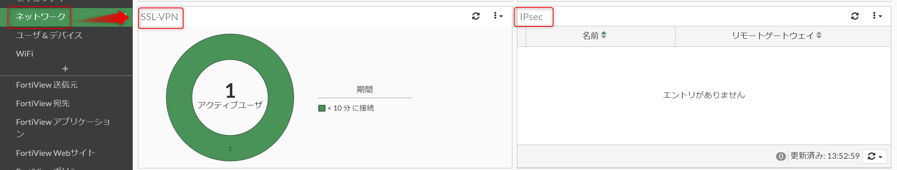
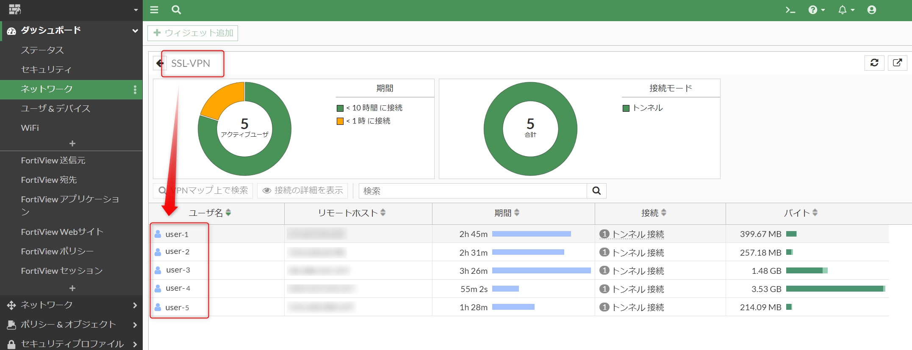
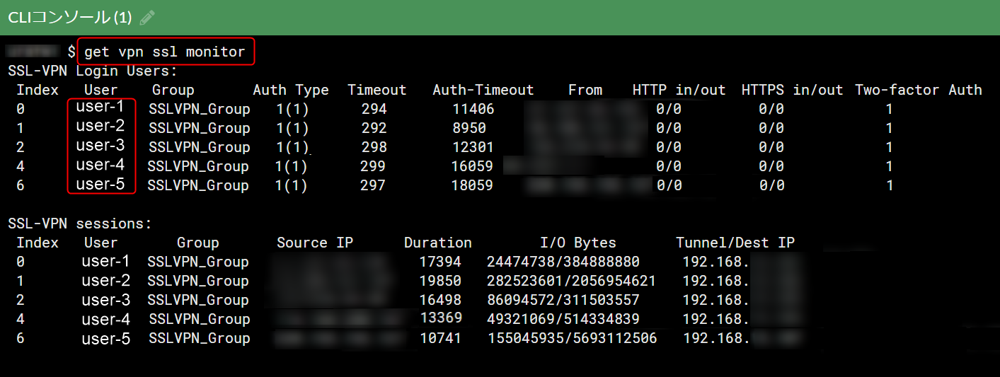

みなさまこんにちは、リーフです。

さっそくですが、先日 VPN 機器として稼働している FortiGate に対して設定変更を行う必要がありました。

機器の設置前など、稼働していない環境であれば任意のタイミングで設定の変更が可能ですが、
すでに稼働している環境の場合ユーザーへ影響が少ない時間帯に実施する必要があります。

もちろん夜間や休日に実施することも1つの手ですが、VPN 接続中ユーザーの有無が分かれば、ユーザーが居ないタイミングで設定を変更できます。

今回は FortiGate で*リアルタイムに VPN 接続中のユーザー有無*を確認する方法を紹介します。

弊社では主に **SSL-VPN** を使用していますが、 **IPsec** を使用した際の確認方法も紹介します。

※あくまでも VPN 接続中のユーザーを確認する方法ですので社内など、ローカルな環境で接続しているユーザーに関しては別途確認する必要があります。

GUI・CLI の両方で確認が可能です。
お好きな方法で確認してみてください。

### 想定環境
- Forti OS(メジャーバージョン):v7

### GUI で確認する方法
1. FortiGate の管理画面へログインします。

1. 左上のダッシュボード > ネットワークの順番にクリックします。

1. 画面をスクロールし、SSL-VPN または IPsec を選択します。

4. ダブルクリックで詳細が開きます。
**ユーザー名**に表示される名前が現在接続中のユーザーです。

※画像は SSL-VPN のものです。

### CLI で確認する方法
1. FortiGate のコンソールへログインします。

1. 以下のコマンドを入力します。

- SSL-VPN の場合

```get vpn ssl monitor```

- IPsec の場合

```diagnose vpn ike gateway list```

3. `User` に表示される名前が現在接続中のユーザー名です。


※画像は SSL-VPN のものです。

### 最後に
いかがでしたでしょうか。

今回は FortiGate で VPN 接続中ユーザーの確認をしました。

稼働中の環境で設定を変更する場合は、ぜひ本手順で一度影響確認を行ってみてください。

それではまた、リーフでした。🍃
