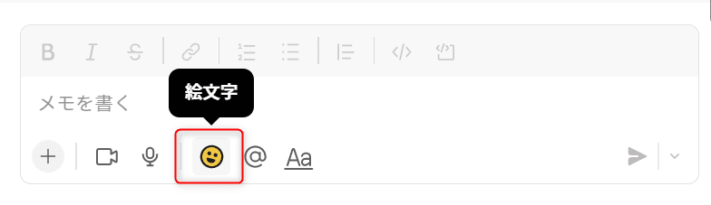

初めまして、リーフです。

お仕事で Slack を使用されている方は多いと思います。

Slack はスタンプが豊富で楽しいですよね。

社内で作成されたオリジナルスタンプを使用したことがある方も多いのではないでしょうか。

今回はそんなオリジナルスタンプを追加する方法を紹介します。

## スタンプにする画像の準備

まずは以下のフォーマットを参考に、スタンプにする画像を用意します。

【画像フォーマット】

- サイズ： **128px ✖ 128px**
- 容量　： **128KB**
- 形式　： **JPG・GIF・PNG**

なお、画像サイズが大きすぎる場合は自動的にリサイズされてしまうので、注意が必要です。

サイズを意識して画像を作成すればきれいなスタンプが作成できます。

### テキストの場合

テキストを使用したスタンプの場合、4文字のスタンプがバランスも良くきれいに表示できます。

また、一文字にするとインパクトの強いスタンプが作成できますよ。

テキストのスタンプ用画像を作成するのであれば、 [絵文字 ジェネレーター](https://emoji-gen.ninja/) など、使い易いツールがたくさんあります！

こちらのツールであれば、背景を透過したものを自動で作成してくれます。

### 画像・イラストの場合

画像の場合どうしてもサイズの関係で潰れてしまいがちですので、単純なイラストがおすすめです。

[MEGAMOJI](https://zk-phi.github.io/MEGAMOJI/) では、絵が描けない方でもパーツを組み合わせて簡単に絵文字が作成できます。

今回は弊社の社長イラストをこっそり拝借してスタンプにしたいと思います。

背景を透過した画像が推奨されていますが、イラストによっては塗りつぶした方がハッキリと表示できるかもしれませんね。

## Slackへの追加方法

ではいよいよ Slack にスタンプを追加していきます。

1. テキスト入力欄にある**☺マーク**(絵文字)を選択します。

2. 次に **絵文字を追加する** を選択します。

3. 追加するスタンプの **画像をアップロード** します。

今回は、用意した画像の中から1つ選択します。

4. スタンプを **保存** します。

スタンプの名前は画像のファイル名あらかじめ画像に沿ったファイル名をつけておけば簡単に設定できます。

以下のような表示が出れば追加完了！

使えるようになります。

無事スタンプが追加できました！

追加したスタンプは、絵文字一覧から右上の Slack アイコンから使用できます。

今回は、 Slack にオリジナルスタンプを追加する方法を紹介しました。

とても簡単ですのでぜひ追加してチャットを盛り上げてくださいね！

では、リーフでした。🍃

## 参考

- [ワークスペースにカスタム絵文字とエイリアスを追加する](https://slack.com/intl/ja-jp/help/articles/206870177-%E3%83%AF%E3%83%BC%E3%82%AF%E3%82%B9%E3%83%9A%E3%83%BC%E3%82%B9%E3%81%AB%E3%82%AB%E3%82%B9%E3%82%BF%E3%83%A0%E7%B5%B5%E6%96%87%E5%AD%97%E3%81%A8%E3%82%A8%E3%82%A4%E3%83%AA%E3%82%A2%E3%82%B9%E3%82%92%E8%BF%BD%E5%8A%A0%E3%81%99%E3%82%8B)
