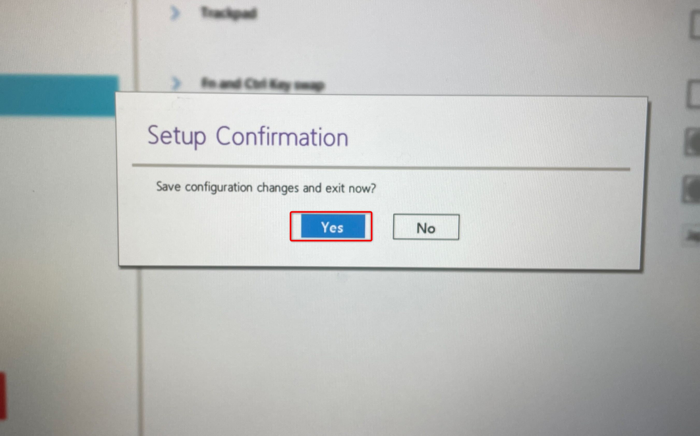

こんにちはリーフです。

弊社では主に Lenovo 社の PC である **ThinkPad** を使用しており、先日新しい PC のセットアップを行いました。

新しく入社された方に操作をしてもらいながら、設定をしていましたが
`Ctrl + C` などのキーボードショートカットがうまく反応しないという話を聞きました。

様子をみていると、どうやら単純に Fn (ファンクション)キーと Ctrl (コントロール)キーを押し間違えていたようです。

単純な押し間違いですが、ハッキリとした原因がありました。

一般的に販売されている多くのノート PC は **Ctrl Fn** の順番でキーが配置されているのに対し
ThinkPad は **Fn Ctrl** の順番でキーが配置されています。

それにより初めて ThinkPad を使った方が、普段と同じように打鍵することで押し間違いが発生していたというわけです。

また、Lenovo の PC でも Ctrl Fn の順番でキーが配置されているものあります。

そこでいくつかのノート PC を見比べてみましたが、ThinkPad だけキー配置が異なりました。

Ctrl Fn の順番で配置されていることが圧倒的に多いことが分かります。

そんなキー配置の ThinkPad ですが実は2つのキーの機能を入れ替える機能が備わっています。

キーを入れ替える方法は2つありますのでそれぞれ紹介します。

場合によって使い分けてみてください。

### Lenovo Vantage を使用する方法
こちらは比較的簡単に変更が可能です。

1. Lenovo Vantage を起動し、右上の「ハンバーガーボタン🍔」>「入力およびアクセサリ」を選択

2. 下にスクロールし、「**Fn キーと Ctr キーの入れ替え**」を ON にする

以上で完了です。とっても簡単ですね。

### BIOS(バイオス)設定画面から変更する方法
こちらは少し手順が複雑です。

まず BIOS 画面を表示します。

※以下の手順を行うとPCが再起動します。
編集中のファイルがある場合、あらかじめ保存してください。

1. 設定を開き、「システム」>「回復」を選択

2. 回復オプションで「今すぐ再起動」を選択

3. オプションの選択で「トラブルシューティング」>「詳細オプション」

4. 詳細オプションで「UEFI ファームウェアの設定」>「再起動」と選択

5. BIOS 設定画面が開いたら「Config」>「Keyboard/Mouse」を選択

6. 「Fn and Ctrl Key swap」を **ON** に変更し設定を**保存**

以上で完了です。

PC を起動しキーの機能が入れ替わっていることを確認してください。

### さいごに
今回は ThinkPad の Fn キーと Ctrl キーの機能を入れ替える方法を紹介しました。

どなたかの悩みが解消できれば幸いです。

ではまた、リーフでした。🍃
