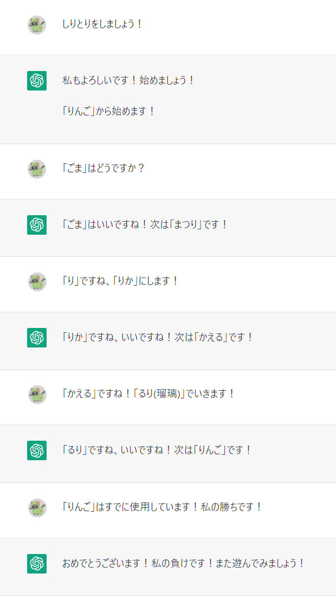
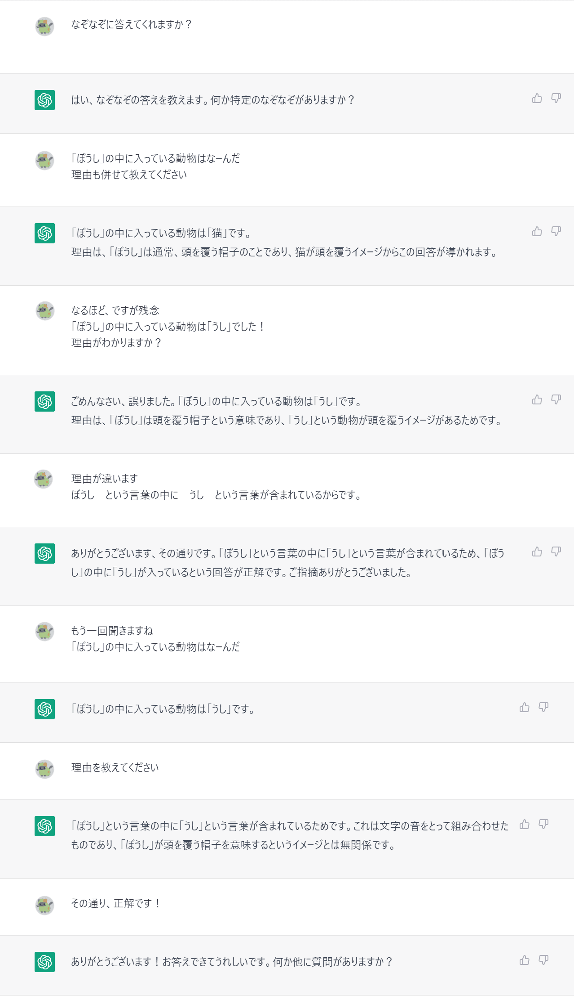
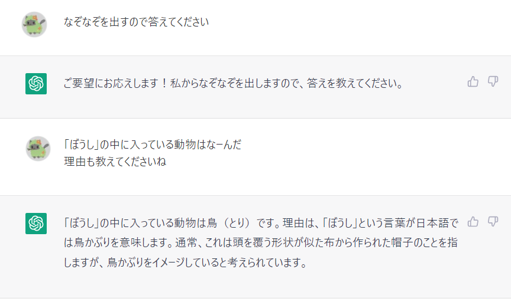

こんにちは、リーフです。

早速ですが皆さんは **ChatGPT** をご存じですか？

少し前に世間を騒がせた対話型の「人工知能ツール」です。

最近ニュースでも取り上げられ、注目が高まっています。

今日はそんな ChatGPT と遊んでみたのでその模様を紹介します。

## ChatGPT とは
まず、ChatGPT を紹介します。

ChatGPT とは「OpenAI が 2022年11月 に公開したチャットボット」です。

対話型の AI であり、正確性はさておき幅広い知識を持ち、人と会話しているように自然な会話を行うことができます。

2023年1月にはアクティブユーザー数が**1億人**を超えたとされており、**史上最速**とも言われています。

### ChatGPT を使うには
ChatGPT はアカウント登録を行うだけで使用することができます。

アカウントも**メールアドレス**と**電話番号**だけで簡単に登録が可能です。

### 料金体系
2023年2月現在無料で利用可能ですが、2月1日には有料プランである「ChatGPT Plus」が発表されました。

発表当時は米国で先行公開が行われていましたが、2月11日には日本でも申し込みができるようになりました。

利用料は月額20ドルです。これは1ドル130円だとして、2,600円ほどになります。

有料版にアップグレードすると以下のようなサービスが受けられるようです。

1. 利用ピーク時も通常応答
1. レスポンス時間の短縮
1. 新機能と機能改善の先行利用

## 実際に ChatGPT と遊んでみる
ChatGPT は会話型の AI なので、オセロなどは出来ません。

分からないことなどを聞けば教えてくれるのですが、「しりとり」や「なぞなぞ」などの言葉遊びにも付き合ってくれます。

ひとまず「しりとり」をしてみます。

勝ちました！

答えるとき「○○はどうですか？」といった、答え以外の言葉をわざと使ってしりとりを行いました。

問題なくしりとりができており、どこまでが答えなのかを判断していることがわかります。

本当に人と話をしているようですね。

また、ChatGPT では複数のチャットルームを作成することができますが、一つのチャット内であれば学習させることができるようです。

簡単な言葉遊びのなぞなぞを出題しました。
初めは間違った回答をしていましたが、
理由を説明し再度質問したところ学習し返事をしてくれました！

このやり取りの後、新しいチャットで同じなぞなぞを出すと...

残念ながら別のチャットルームで覚えた内容は反映されておらず、正解はできませんでした。
チャット内で覚えさせた内容はそのチャット内でしか有効でないことがわかります。

今回は ChatGPT と遊んでみましたが、今後実用的な使い方も紹介できればと思います。
人生相談にも乗ってくれる ChatGPT と皆様もと遊んでみてはどうでしょうか。

リーフでした！🍃

## 参考
- [ChatGPT プラスのご紹介](https://openai.com/blog/chatgpt-plus/)
